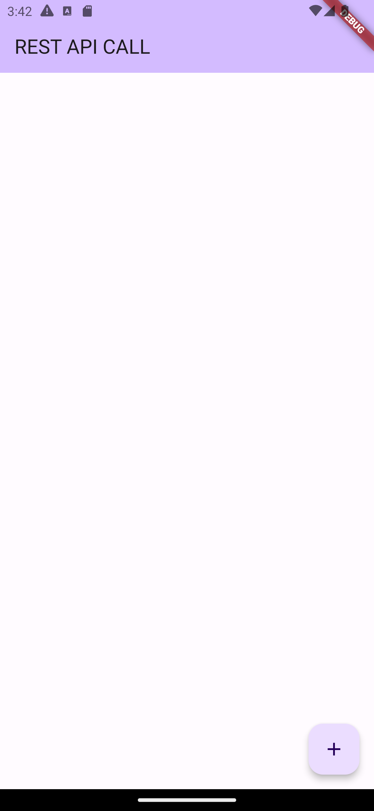

# api_call_01

1) The key to working with this API was to request a date with an http packet, and the incoming date was bound to an empty list of users. users is an important variable.
2) The users variable is applied to the ListView.builder and the dates in it are created in the ListTile.
3) Whenever I click on the FloatingActionButton I pass the fetchUsers() function to the FloatingActionButton so that the dates are displayed on the screen.
